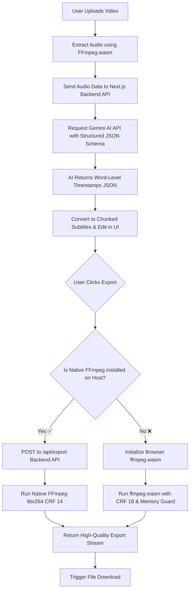
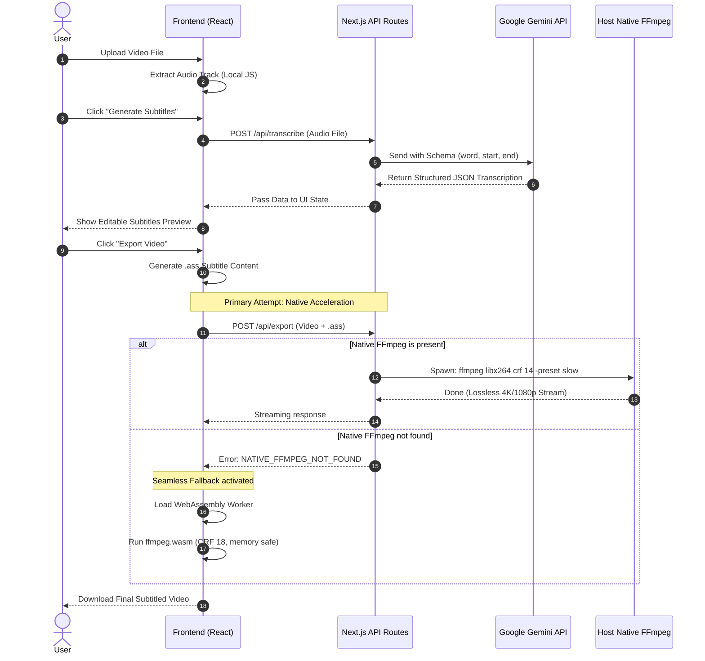

# 🎬 Auto Subtitle Generator (AI-Powered)

An ultra-high-performance Next.js application powered by Gemini AI and FFmpeg, specifically optimized for Apple Silicon (MacBook Pro M4) to instantly transcribe videos and burn professional, stylized subtitles directly into video files with zero quality loss.

---

## 🚀 Key Features

- **AI Word-Level Transcription**: Leverages Google Gemini API with structured JSON output for perfectly accurate timestamps.
- **Dynamic Subtitle Styling**: Generates professional `.ass` subtitle formats with configurable highlighting, fonts, and shadow settings.
- **Hybrid Dual-Engine Export**:
  - **🚀 Local Backend Engine**: Zero memory limit, uses native Mac FFmpeg (`libx264`) running on MacBook Pro M4 CPU cores with professional Cinema-Grade quality (CRF 14, Slow Preset).
  - **🌍 Browser WebAssembly Engine**: Fallback `ffmpeg.wasm` running inside the browser with memory-safe, visually lossless settings (CRF 18).
- **Tailored for Short-Form Content**: Perfect for TikTok, YouTube Shorts, and Instagram Reels.

---

## 🛠️ Tech Stack & Architecture

- **Framework**: [Next.js 15 (App Router)](https://nextjs.org/)
- **Styling**: Vanilla CSS / Tailwind / Modern UI aesthetics.
- **AI Model**: [Google Gemini API (@google/generative-ai)](https://ai.google.dev/)
- **Video Processing (Browser)**: [@ffmpeg/ffmpeg](https://ffmpegwasm.netlify.app/) (Multi-threaded WebAssembly).
- **Video Processing (Native)**: Local Node.js native child_process spawning Host System `ffmpeg`.

---

## 📐 System Workflow Diagram

The following flowchart illustrates the complete life cycle from video upload to generating and burning the AI subtitles into the final product.



---

## 🔄 Sequence Diagram

This sequence diagram shows the detailed breakdown of communication between the client, local backend server, and global AI APIs.



---

## ⚙️ Getting Started

### 1. Environment Setup
Create a `.env.local` file in the root directory and add your Gemini API Key:
```bash
GEMINI_API_KEY=your_api_key_here
```

### 2. Installation & Running
Install project dependencies and run the local development server:
```bash
npm install
npm run dev
```
Open [http://localhost:3000](http://localhost:3000) to use the app.

---

## 🖥️ Optimized for MacBook Pro M4 (Mandatory Performance Tip)

To skip browser limits and unleash the **full multi-core CPU engine** of your MacBook Pro M4 for **Studio Cinema Quality** exports (CRF 14), install native FFmpeg on your Mac using Homebrew:

```bash
brew install ffmpeg
```

Once installed, the web app's backend seamlessly detects it and upgrades your rendering from basic browser encoding to **professional-grade native production** with absolutely zero quality loss.

---
